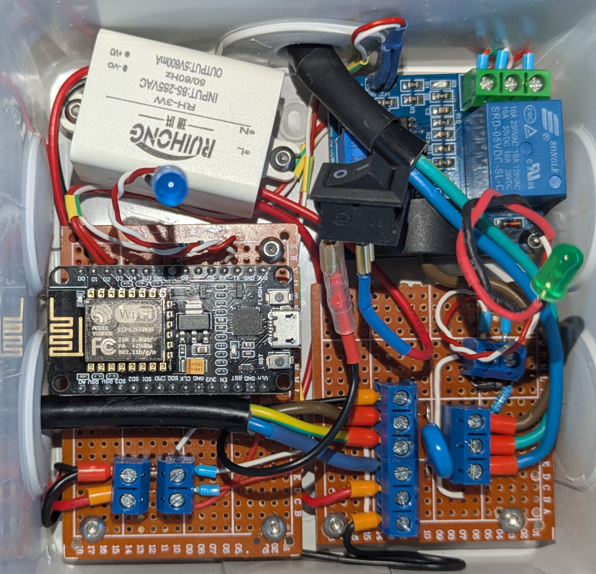
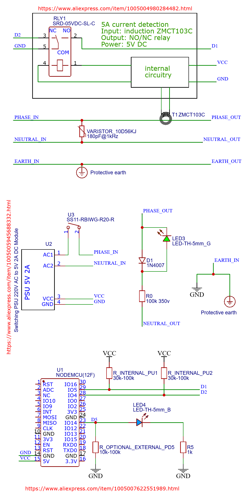

# GpioChangeNotifier on NodeMCU 8266 using Arduino IDE

Hardware (in a derivation box) :

Schematic (done in EasyEDA) :

Hardware and schematic on OpenSource Hardware Lab : https://oshwlab.com/nipil/gcn-esp8266

EasyEDA editor : https://easyeda.com/editor#project_id=a4e3cc775c9943d58ffc321e2efb51e4

# Arduino monitor

Thanks to https://www.emqx.com/en/blog/esp8266-connects-to-the-public-mqtt-broker for the MQTT tutorial.

Features :

- no write to flash, ever, for durability
  - multiple hardcoded wifi credentials
  - periodic hardcoded reboots to reinitialize

- network time synchronization via SNTP at boot
  - optional periodic resynchronization

- multiple digital pin monitor
  - input de-bouncing
  - recording upon change interrupt (one per pin)
  - sample recorded in circular buffer of configurable (hardocded) size
  - for seldom changing inputs, works to to cope with temporary "offline periods"

- Optional TLS to the MQTT broker
  - always-on verification of the TLS communication
  - no "disable verification" option
  - restricted to TLS 1.2, and optionnal hardening of TLS ciphers
  - authentication via username/password, no need for client certificate
  - only LetsEncrypt CA certificates are included, for use with publicly reachable servers
  - fast TLS session resumtion for faster reconnection upon deconnection (but not through sleep/reboots)

- Optional remote control capabilities
  - resynchronize time from network
  - disconnect from mqtt
  - disconnect from wifi
  - reboot

- Auxiliary functions
  - blinking led for status and mode
  - fully informative serial output
  - compile-time configurable debugging output
  - collecting metrics (uptime, network, memory, mqtt)

## Board setup

- File / Preferences
  - Additionnal boards manager URLs, add using comma separation, then validate :
    - http://arduino.esp8266.com/stable/package_esp8266com_index.json

- Tools / Board ... / Board manager
  - search 8266, and install (version 3.1.2 as of this writing)
    - Documentation : https://github.com/esp8266/Arduino (uses https://www.bearssl.org/ for SSL)
    - Debugging : https://arduino-esp8266.readthedocs.io/en/latest/Troubleshooting/debugging.html
        - Tools / Debug Port / Serial
        - Tools / Debug Level / SSL to debug BearSSL

- Tools / Board ... / esp8266 / NodeMCU 1.0 ESP-12E module

- Tools / Stack protection / enable

- Tools / CPU Frequency / 160 MHz (better when dealing with TLS)

- Use the board and port dropdown
  - select "other board and port"
  - select the NodeMCU Board above
  - plug your board and select your USB com-port

- Test with the blink example
  - File / Examples / 0.1 Basics / blink
    - Sketch / Verify and compile
	- Sketch / Upload
  - The internal board led should blink

## Additional code

- Tools / Manage libraries
  - `PubSubClient` by Nick O'Leary (version 2.8.0 as of this writing)
    - Documentation : http://pubsubclient.knolleary.net/

## Resulting MQTT data

Here is all the MQTT topics pushed  by the client (most are optional, and configured at compile time)

    mosquitto_sub -h xxx.yyyyyyyyyyyyy.zzz -p 8883 -u username -P password -t 'gcn/#' -v

    gcn/AA:BB:CC:DD:EE:11/out/status online
    gcn/AA:BB:CC:DD:EE:11/out/hardware esp8266
    gcn/AA:BB:CC:DD:EE:11/out/esp8266/reset_reason Software/System restart
    gcn/AA:BB:CC:DD:EE:11/out/esp8266/chip_id 10000007
    gcn/AA:BB:CC:DD:EE:11/out/esp8266/core_version 3.1.2
    gcn/AA:BB:CC:DD:EE:11/out/esp8266/sdk_version 2.2.2-dev(38a443e)
    gcn/AA:BB:CC:DD:EE:11/out/esp8266/cpu_freq_mhz 160
    gcn/AA:BB:CC:DD:EE:11/out/esp8266/sketch_size 428896
    gcn/AA:BB:CC:DD:EE:11/out/esp8266/free_sketch_size 1667072
    gcn/AA:BB:CC:DD:EE:11/out/esp8266/sketch_md5 faedb1aaaaaaaaaaaaaaaaaaaaaaaaaa
    gcn/AA:BB:CC:DD:EE:11/out/esp8266/flash_chip_id 1000002
    gcn/AA:BB:CC:DD:EE:11/out/esp8266/flash_chip_size 4194304
    gcn/AA:BB:CC:DD:EE:11/out/esp8266/flash_chip_real_size 4194304
    gcn/AA:BB:CC:DD:EE:11/out/esp8266/flash_chip_speed_hz 40000000
    gcn/AA:BB:CC:DD:EE:11/out/esp8266/check_flash_crc 1
    gcn/AA:BB:CC:DD:EE:11/out/esp8266/free_heap 14104
    gcn/AA:BB:CC:DD:EE:11/out/esp8266/heap_fragmentation_percent 4
    gcn/AA:BB:CC:DD:EE:11/out/esp8266/max_free_block_size 13544
    gcn/AA:BB:CC:DD:EE:11/out/uptime/system_ms 1208886
    gcn/AA:BB:CC:DD:EE:11/out/uptime/wifi_ms 1208449
    gcn/AA:BB:CC:DD:EE:11/out/uptime/sntp_ms 1204669
    gcn/AA:BB:CC:DD:EE:11/out/uptime/mqtt_ms 1203653
    gcn/AA:BB:CC:DD:EE:11/out/uptime/unix_timestamp 1750509320
    gcn/AA:BB:CC:DD:EE:11/out/network/local_ip 192.168.x.y
    gcn/AA:BB:CC:DD:EE:11/out/network/netmask 255.255.u.v
    gcn/AA:BB:CC:DD:EE:11/out/network/gateway_ip 192.168.x.t
    gcn/AA:BB:CC:DD:EE:11/out/network/dns/0 192.168.w.z
    gcn/AA:BB:CC:DD:EE:11/out/network/ssid Bbox-1C92C458
    gcn/AA:BB:CC:DD:EE:11/out/network/bssid 11:22:33:44:55:66
    gcn/AA:BB:CC:DD:EE:11/out/network/rssi -74
    gcn/AA:BB:CC:DD:EE:11/out/mqtt/sent_ok 115
    gcn/AA:BB:CC:DD:EE:11/out/mqtt/sent_error 0
    gcn/AA:BB:CC:DD:EE:11/out/mqtt/subscribe_ok 5
    gcn/AA:BB:CC:DD:EE:11/out/mqtt/subscribe_error 0
    gcn/AA:BB:CC:DD:EE:11/out/mqtt/connect_ok 1
    gcn/AA:BB:CC:DD:EE:11/out/mqtt/connect_error 0
    gcn/AA:BB:CC:DD:EE:11/out/mqtt/received 1
    gcn/AA:BB:CC:DD:EE:11/out/buffer_total_dropped_item 0
    gcn/AA:BB:CC:DD:EE:11/out/gpio/D1 1 1750508119
    gcn/AA:BB:CC:DD:EE:11/out/monitored_gpio D1
    gcn/AA:BB:CC:DD:EE:11/out/heartbeat 1750509320
    gcn/AA:BB:CC:DD:EE:11/out/heartbeat 1750509350

IMPORTANT : even if we export network information, no privacy data is collected (neither passwords nor public IPs)

Within these values, some units need explaining :

- all size values are in bytes
- some values have unit in name's suffix
- `gcn/+/out/uptime/#` : function uptime in raw arduino `millis()` (duration since boot)
- `heartbeat`, `unix_timestamp`, GPIO change second value, are all `unix timestamp` (seconds since 1970-01-01 midnight UTC)

Here is a log sample regarding inputs (here, only for the a single GPIO)

    # at boot, publish current state
    Jun 21 11:34:09 myserver mosquitto[565]: 1750498449: Received PUBLISH from gcn-AA_BB_CC_DD_EE_11 (d0, q0, r1, m0, 'gcn/AA:BB:CC:DD:EE:11/out/gpio/D1', ... (12 bytes))
    # on change, publish new value
    Jun 21 11:34:21 myserver mosquitto[565]: 1750498461: Received PUBLISH from gcn-AA_BB_CC_DD_EE_11 (d0, q0, r1, m0, 'gcn/AA:BB:CC:DD:EE:11/out/gpio/D1', ... (12 bytes))
    # on change, publish new value
    Jun 21 11:34:35 myserver mosquitto[565]: 1750498475: Received PUBLISH from gcn-AA_BB_CC_DD_EE_11 (d0, q0, r1, m0, 'gcn/AA:BB:CC:DD:EE:11/out/gpio/D1', ... (12 bytes))
